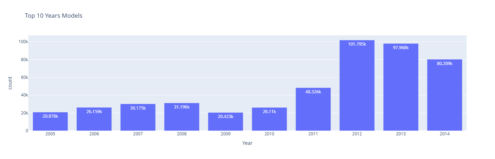
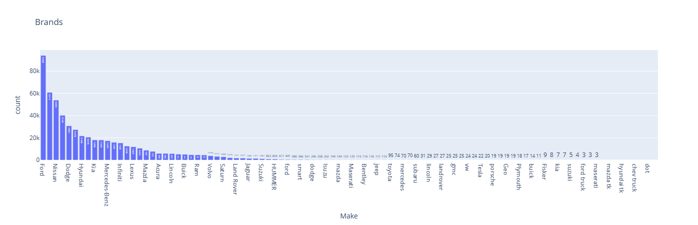
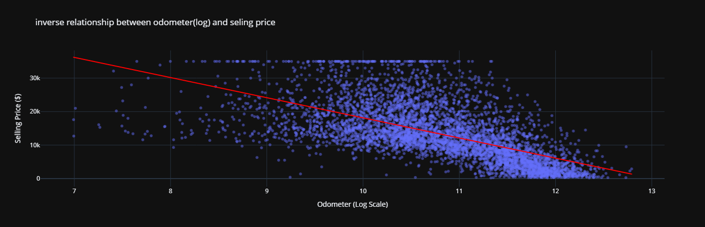
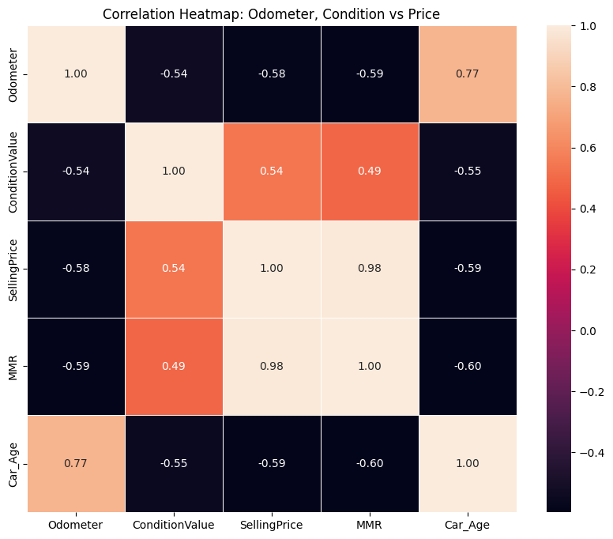
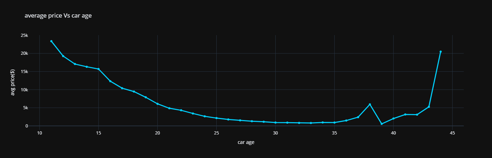
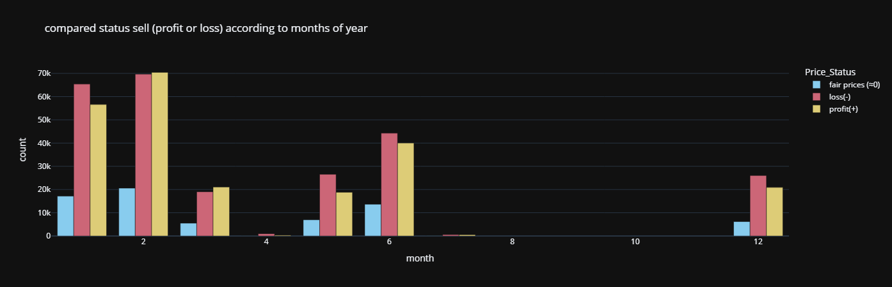

# 🚗 Cars Market Analysis Project 📊

هذا المشروع يقدم تحليلًا مفصلاً لسوق السيارات بناءً على مجموعة بيانات شاملة، بهدف استخراج رؤى (Insights) تساعد في فهم العوامل المؤثرة على أسعار السيارات وتوزيع العلامات التجارية.

## 🎯 أهداف المشروع (Project Objectives)
* تحليل العلاقة بين خصائص السيارة (مثل الموديل، سنة الصنع، والمسافة المقطوعة) وبين **السعر النهائي**.
* تحديد أكثر العلامات التجارية (Brands) انتشارًا وقيمة في السوق.
* تنظيف البيانات (Data Cleaning) ومعالجة القيم المفقودة لضمان دقة التحليل.
* تقديم تصورات بيانية (Visualizations) تلخص نتائج البحث بشكل احترافي.

## 🛠 الأدوات المستخدمة (Tech Stack)
* **Python**: اللغة الأساسية للتحليل.
* **Pandas & NumPy**: لمعالجة البيانات والجداول الضخمة.
* **Matplotlib & Seaborn & Plotly**: لعمل الرسومات البيانية والـ Heatmaps.
* **Jupyter Notebook**: البيئة التي تم فيها تنفيذ الكود.

## 📁 محتويات المشروع (Project Structure)
* `Cars Project Final.ipynb`: ملف الكود الرئيسي الذي يحتوي على خطوات التنظيف والتحليل.
* 
* `2020_Nissan_Altima_Trim_Levels.png`: صورة توضيحية لواحد من الموديلات المحللة.
* `Cars_Analysis_Report_FFFFFINAL.pdf`: ريبورت بيوضح كل تفاصيل البروجيكت.

### 📈 Key Visualizations
في هذا القسم، نستعرض أهم الرسوم البيانية التي تلخص حالة سوق السيارات بناءً على البيانات:
| Top Years | Top Brands |
|---|---|
|  |  |

| Price vs Mileage | Correlation Heatmap |
|---|---|
|  |  |
|  |  |
|**تحليل الاتجاه الزمني:** يوضح كيفية تغير الأسعار أو الكميات عبر الفترات الزمنية المختلفة. |**مقارنة أداء المبيعات شهرياً (Grouped Bar Chart):** تحليل يوضح حجم مبيعات السيارات (Count) موزعة حسب شهور السنة، مع تصنيف كل شهر إلى ثلاث فئات: مبيعات بربح (Profit)، مبيعات بخسارة (Loss)، وأسعار عادلة (Fair Prices).. |

---
## 💡 أهم النتائج (Key Insights)
> [!TIP]
> من خلال التحليل تبين أن سنة الصنع ونوع العلامة التجارية هما المحركان الأساسيان لتقلبات الأسعار، مع وجود علاقة عكسية واضحة بين المسافة المقطوعة (Mileage) وسعر البيع.

## 🚀 كيفية التشغيل (How to run)
1. قم بتحميل المستودع (Clone the repository).
2. تأكد من تثبيت المكتبات اللازمة:
   ```bash
   pip install pandas matplotlib seaborn numpy
